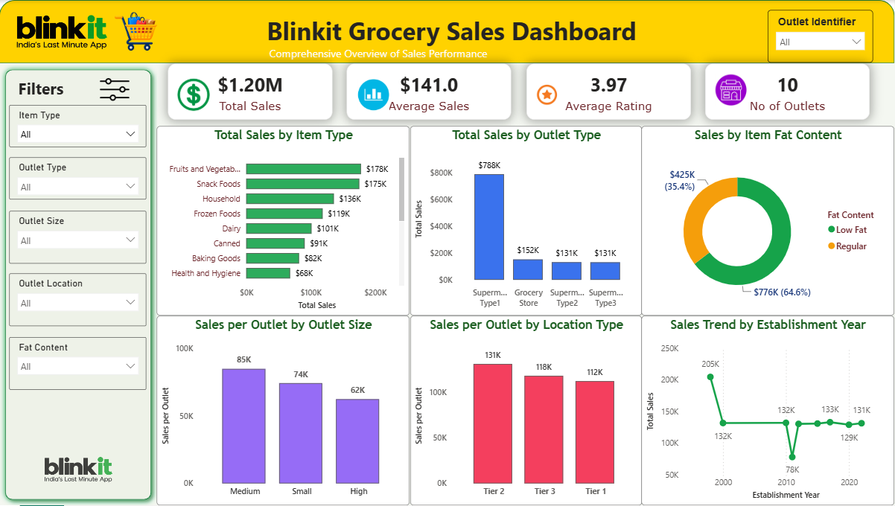

# Blinkit Sales Analysis

An end-to-end data analytics project evaluating Blinkit's e-commerce sales performance to uncover key revenue drivers, top-performing product categories, and optimal outlet formats for business expansion.

---

## 📌 Project Overview

This project analyzes Blinkit's transactional and operational data using **Python**, **SQL**, and **Power BI**. By evaluating performance metrics across product categories, item features, and outlet sizes, this analysis provides actionable insights for optimizing product offerings and retail growth.

---

## 🎯 Business Problem & Objectives

### **Business Questions**
* **Product Prioritization:** Which products and item categories generate the highest revenue and should be prioritized in inventory?
* **Expansion Strategy:** Which outlet formats and location tiers yield optimal performance and growth potential?

### **Core Objectives**
1. Analyze total sales performance across product types, categories, and fat content.
2. Identify top-selling items and revenue-driving categories.
3. Compare performance metrics across different outlet sizes, types, and establishment years.
4. Deliver strategic recommendations to improve sales performance and operational efficiency.

---

## 🛠️ Tools & Technologies

* **Data Processing & EDA:** Python (Pandas)
* **Database & Querying:** SQL (`sql1.sql`)
* **Visualization & Dashboarding:** Power BI (`blinkit dashboard.pbix`)
* **Documentation & Reporting:** Project Report PDF (`Project_report_of_eCommerce.pdf`)

---

## 🔄 Project Workflow

Raw Data ➔ Data Cleaning (Python) ➔ Exploratory Data Analysis ➔ SQL Querying ➔ Power BI Dashboard ➔ Insights & Recommendations ➔ Project Report


1. **Data Cleaning & Processing:** Handled missing values, standardized product categories, and cleaned fat content labels in Python to create `cleaned_data.csv`.
2. **SQL Data Analysis:** Ran analytical SQL queries to aggregate key performance indicators across outlet tiers and item categories.
3. **Power BI Dashboard:** Created an interactive dashboard featuring KPI cards, outlet performance matrices, and category breakdowns.
4. **Documentation:** Synthesized key findings into a comprehensive project report.

---

## 📊 Dashboard Overview

The interactive dashboard (`blinkit dashboard.pbix`) provides visual insights including:
* **Total Sales & Order Metrics:** High-level KPIs tracking performance.
* **Category Breakdown:** Sales distribution across item types and fat content.
* **Outlet Performance Matrix:** Comparative analysis of sales by outlet size, location tier, and establishment type.



---

## 📁 Repository Structure

```text
Ecommerce_sales_analysis/
│
├── .gitignore                      # Git ignore file
├── Blinkit Grocery Data.csv         # Raw dataset
├── cleaned_data.csv                 # Processed and cleaned dataset
├── blinkit dashboard.pbix          # Power BI interactive dashboard
├── dashboard.png                    # Dashboard preview image
├── main.py                          # Python script for data processing & EDA
├── sql1.sql                         # SQL queries for analytical insights
├── Project_report_of_eCommerce.pdf  # Detailed project report
└── README.md                        # Project documentation
🚀 How to Run / Get Started
1. Clone the Repository
Bash
git clone [https://github.com/your-username/Ecommerce_sales_analysis.git](https://github.com/your-username/Ecommerce_sales_analysis.git)
cd Ecommerce_sales_analysis
2. Run Data Processing Script
Ensure Python is installed along with pandas, then run:

Bash
python main.py
3. Database Querying
Execute sql1.sql in your SQL database environment (MySQL / PostgreSQL / SQLite) using cleaned_data.csv as the data source.

4. View Dashboard
Open blinkit dashboard.pbix using Power BI Desktop to interact with the visualizations.

📄 Project Report
For a complete breakdown of methodology, findings, and business recommendations, refer to Project_report_of_eCommerce.pdf.